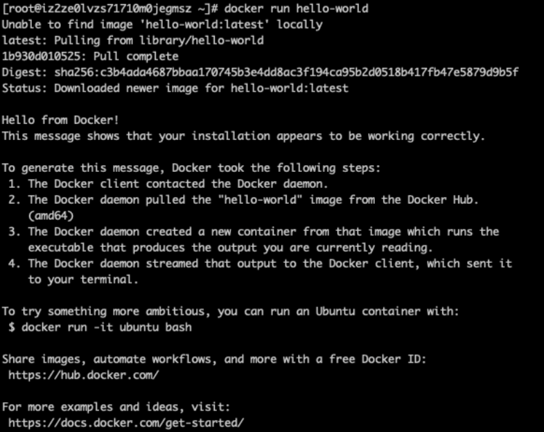

# CentOS7 安装 Docker

参考文档

https://developer.aliyun.com/article/765545


1、通过 uname -r 命令查看你当前的内核版本

```
$ uname -r
```

2、root权限更新Yum包（linux命令不熟悉的同学本文建议使用root权限登陆安装docker，省去很多不必要麻烦）

```
$ yum update
```

3、卸载旧版本：（如果安装过旧版本的话）
(旧版名称是docker , 最新社区版 docker-engine， 目前已改名为docker-ce )

```
$  yum -y remove docker docker-common docker-selinux docker-engine
```

4、设置Yum源：（本文以Yum安装为例子进行安装）
安装 yum-utils , 使用 yum-config-manager 工具设置Yum源, 后面两个是 devicemapper驱动依赖

```
$ yum install -y yum-utils device-mapper-persistent-data lvm2
```

执行以下命令，添加docker的yum源

```
$ yum-config-manager --add-repo https://download.docker.com/linux/centos/docker-ce.repo
```

此处可能会报错 （原因是国内访问不到docker官方镜像的缘故）

```
Loaded plugins: fastestmirror（镜像）
adding repo from: https://download.docker.com/linux/centos/docker-ce.repo
grabbing file https://download.docker.com/linux/centos/docker-ce.repo to /etc/yum.repos.d/docker-ce.repo
Could not fetch/save url https://download.docker.com/linux/centos/docker-ce.repo to file /etc/yum.repos.d/docker-ce.repo: 
[Errno 14] curl#35 - "TCP connection reset by peer
```

   解决方法 ： 使用阿里源访问

```
$ yum-config-manager --add-repo http://mirrors.aliyun.com/docker-ce/linux/centos/docker-ce.repo
```

5、查看所有仓库中docker版本，并选择特定版本安装：(此处我们查看社区版 docker-ce)

```
$ yum list docker-ce --showduplicates | sort -r
```

6、配置镜像加速器（必须要配置，否则会出现访问镜像并不稳定 ，而且下载缓慢等问题）
a. 注册阿里云账号 ，登陆该网址自行注册 ( https://www.aliyun.com/?utm_content=se_1010377 )
b. 进入阿里云控制台如图 ( https://cr.console.aliyun.com/#/accelerator )
执行命令 :

```
mkdir -p /etc/docker
vim /etc/docker/daemon.json
{
  "registry-mirrors": ["https://o0070a4l.mirror.aliyuncs.com"]
}
systemctl daemon-reload    （导入操作）
```

7、安装docker (此处我们安装社区版 docker-ce)

```
$ yum install docker-ce (这样写默认安装最新版本)
$ yum install  docker-ce-<VERSION_STRING> (指定安装版本) 
例： yum install docker-ce-18.03.1.ce
```

8、启动并加入开机启动

```
$ systemctl start docker       (重启命令  $  systemctl restart docker ) 
$ systemctl enable docker   开机启动
$ docker version  查看docker版本号
```

9、验证是否安装成功

```
$ docker run hello-world
```

出现下图提示就是成功了：
