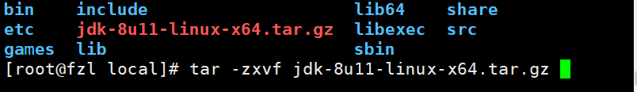

### 1、下载好安装包，解压当前文件夹

```
tar -zxvf jdk-8u351-linux-x64.tar.gz
```



### 2、修改环境变量

```
vi /etc/profile
```

####  2.1在文件profile的最后一行加上，注意：JAVA_HOME=对应的是自己的jdk存放路径，编辑后保存并退出

```
export JAVA_HOME=/opt/jdk1.8.0_351/
export JRE_HOME=${JAVA_HOME}/jre
export CLASSPATH=.:${JAVA_HOME}/lib:${JRE_HOME}/lib:$CLASSPATH
export JAVA_PATH=${JAVA_HOME}/bin:${JRE_HOME}/bin
export PATH=$PATH:${JAVA_PATH}
```


#### 2.2刷新配置文件

```
source /etc/profile
```

 

### 3、命令行输入java -version，出现以下界面，说明安装成功：

```
java -version
```


### 4、使用cli连接zk：

```
./bin/zkServer.sh start ./conf/zoo.cfg
./bin/zkServer.sh status
./bin/zkCli.sh  -server localhost:2181

```
