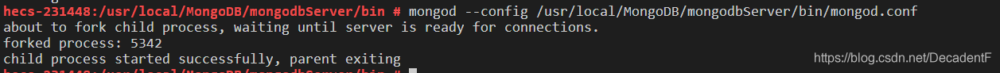
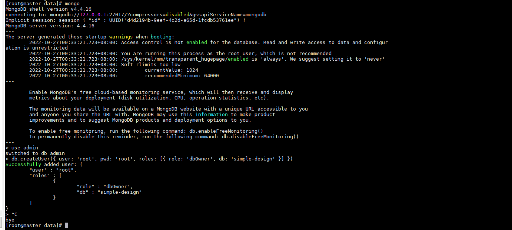

### 1、在服务器 /usr/local 下创建 MongoDB 文件夹，用来存放安装包、服务以及之后 MongoDB 的数据库和日志文件。

```
cd /usr/local		// 进入安装目录
mkdir MongoDB		// 创建MongoDB文件夹
cd MongoDB		// 进入创建的MongoDB文件夹
mkdir source		// 在MongoDB文件夹下创建source文件夹用于保存安装包
mkdir data		// 在MongoDB文件夹下创建data文件夹用于后续数据库信息保存
mkdir log		// 在MongoDB文件夹下创建log文件夹用于保存数据库日志


```


### 2、将官网下载的安装包通过FTP工具上传至服务器上一步创建的 MongoDB/source 文件夹下，执行下面解压命令

```
cd /data/MongoDB/source
tar -zxvf mongodb-linux-x86_64-rhel70-4.4.16.tgz /data/MongoDB
```


### 3、重命名解压文件夹名称，方便后续使用

```
cd /data/MongoDB
mv 解压文件夹名称 mongodbServer		// 将解压后的文件夹名称重命名为 mongodbServer

```


### 4、修改profile

```
vim /etc/profile

export MONGODB_HOME=/data/MongoDB/mongodbServer
export PATH=$PATH:$MONGODB_HOME/bin 

source /etc/profile

```

### 5、配置 MongoDB 启动文件，在/data/MongoDB/etc文件夹下创建 mongod.conf 文件

```
cd /data/MongoDB/etc
vim mongod.conf

#数据库路径
dbpath=/data/MongoDB/data
#日志输出文件路径
logpath=/data/MongoDB/log/mongod.log
#错误日志采用追加模式
logappend=true
#启用日志文件，默认启用
journal=true
#这个选项可以过滤掉一些无用的日志信息，若需要调试使用请设置为false
quiet=true
#端口号 默认为27017
port=27017
#允许远程访问
bind_ip=0.0.0.0
#开启子进程
fork=true
#开启认证，!!!!必选先添加用户!!!!
auth=false


```

### 6、启动etcd服务

```
mongod --config /data/MongoDB/etc/mongod.conf

```

出现以下画面即启动成功，此时就可以进去 mongoDB 数据库了。



### 7、指定数据库添加管理用户
#### 从客户端登录mongodb，直接在mongodb的bin目录下执行命令mongo
```
./mongo
```
#### 添加root超级用户
```

use admin
db.createUser(
     {
       user:"root",
       pwd:"root",
       roles:[{role:"root",db:"admin"}]
     }
)

```
#### 添加用户及权限


添加完用户后可以使用show users或db.system.users.find()查看已有用户。
#### 常用 mongoDB 角色
```

数据库用户角色： read、 readWrite
数据库管理角色：dbAdmin、dbOwner、userAdmin
集群管理角色：clusterAdmin、clusterManager、clusterMonitor、hostManager
备份恢复角色：backup、restore
所有数据库角色：readAnyDatabase、readWriteAnyDatabase、userAdminAnyDatabase、dbAdminAnyDatabase
超级用户角色：root
内部角色： __system
```
修改config中auth=true开启验证


### 8、关闭mongoDB

可以使用db.shutdownServer()关闭，并使用权限方式再次启动mongoDB。即将配置文件mongodb.conf末尾的auth=true注释放开，保存后再次启动mongoDB服务
客户端登录后，需要验证才能进行其他操作
```
use admin
db.auth("root","root")   #认证，返回1表示成功
```
### 9、编写启动关闭脚本

#### 进入mongdb的bin目录下，创建脚本
```

cd /data/MongoDB/mongodbServer/bin/
vim mongodb.sh


```

```
#!/bin/bash

start() {  
/data/MongoDB/mongodbServer/bin/mongod  --config /data/MongoDB/etc/mongod.conf 
}  
  
stop() {  
/data/MongoDB/mongodbServer/bin/mongod --config /data/MongoDB/etc/mongod.conf --shutdown  
}  
case "$1" in
start)
start
;;

stop)
stop
;;

restart)
stop
start
;;

*)
echo $"Usage: $0 {start|stop|restart}"
exit 1
esac


```

```
#!/bin/bash

start() {  
/data/MongoDB/mongodbServer/bin/mongod  --config /data/MongoDB/mongodbServer/bin/mongod.conf 
}  
  
stop() {  
/data/MongoDB/mongodbServer/bin/mongod --config /data/MongoDB/mongodbServer/bin/mongod.conf --shutdown  
}  
case "$1" in  
  start)  
 start  
 ;;  
  
stop)  
 stop  
 ;;  
  
restart)  
 stop  
 start  
 ;;  
  *)  
 echo  
$"Usage: $0 {start|stop|restart}"  
 exit 1  
esac
```


#### 保存后执行脚本权限命令：
```
chmod +x mongodb.sh

sh mongodb.sh start
sh mongodb.sh stop
sh mongodb.sh restart


```


通过以下命令查看当前运行的系统服务，里面包含 mongod 服务即启动成功
```
service --status-all

```


