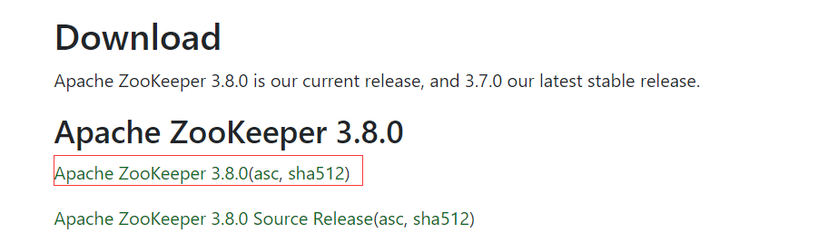
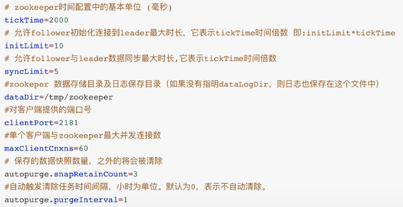

Zookeeper安装
参考文档
文档：1. Zookeeper特性与节点数据类型详解.n...
链接：http://note.youdao.com/noteshare?id=f0549278905bb988c831d6910c54143a&sub=67F7F974690A43B49495E6A5ACB6A594


下载地址：https://zookeeper.apache.org/releases.html
运行环境：jdk8


1）修改配置文件
解压安装包后进入conf目录，复制zoo_sample.cfg，修改为zoo.cfg
```
cp zoo_sample.cfg  zoo.cfg
```
修改 zoo.cfg 配置文件，将 dataDir=/tmp/zookeeper 修改为指定的data目录
zoo.cfg中参数含义：


2）启动zookeeper server
```
# 可以通过 bin/zkServer.sh  来查看都支持哪些参数
# 默认加载配置路径conf/zoo.cfg
bin/zkServer.sh start conf/zoo.cfg

# 查看zookeeper状态
bin/zkServer.sh status
```
3）启动zookeeper client连接Zookeeper server
```
bin/zkCli.sh
# 连接远程的zookeeper server
bin/zkCli.sh -server ip:port

./bin/zkServer.sh start  ./conf/zoo.cfg
./bin/zkServer.sh status
./bin/zkCli.sh  -server localhost:2181

```